**Author**: This is a group project of Min Ni, Santosh Behuray, William Turczyn and Joseph Atalla.

**Prerequesite**:
- Platform: Android SDK (API 25 and later)
- Operating Systems: Android
- User Environment: Android phones or Emulators
- Language Level in Android Studio: 8 (Java 1.8)

## 1 Introduction

This is an Android app, aiming at creating and solving Cryptogram, and also view any Cryptogram related information available in the app. In addition to reading the manual to learn how to play the game, we also included a quick video to teach you how to play. **Click on the image below to watch the video**.

[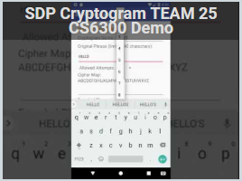](https://youtu.be/lGy0kNfbMrg)

## 2 Supported functions
- Create a new player
- Login with an existing player
- Create Cryptogram
- Choose Cryptogram
- Solve Cryptogram
- View Completed Cryptogram List
- View Cryptogram Statistics

## 3 Documentation

### 3.1 Start new game

Once the application is installed, launch the game to see the screen below.  You are not required to login, so click on the **[START PLAY]** button begin the game. 

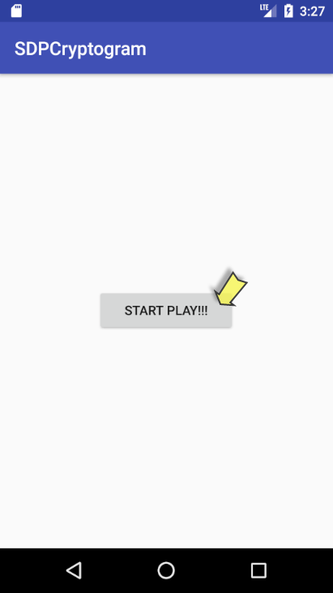 

### 3.2 Create new player

When you start a play, you will be required to create a new player or select from an existing player as shown in the screen below. To create a new player click on the **[CREATE PLAYER]** button.

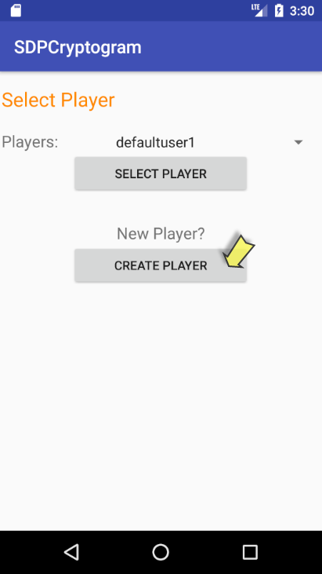

To register a player enter a first name, last name, username and an email then click on the **[SUBMIT]** button. Make sure that the username is unique and the email is valid. If the username already taken you will get "username already taken" error, likewise "Not a valid email" error will be present if an invalid email is entered. Remember, there is no password required for registration.

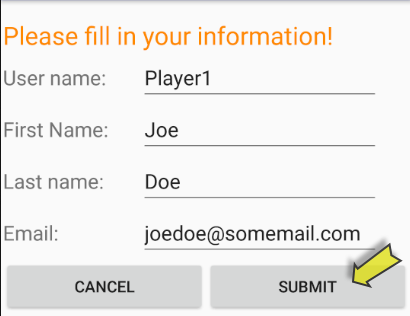 
 

### 3.3 Login with an existing player
When you open the SDPCryptogram app, you will have to option to choose an existing player account or create a new account (as referred above). If you are interested in login in with an existing account, you only need to select from the drop-down list as shown below. Since this is an app installed locally, there is no password required for login.

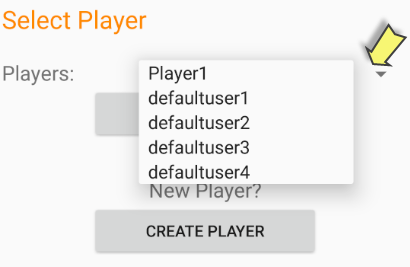 

Once a player is selected from the drop down, click on the **[SELECT PLAYER]** button to continue.

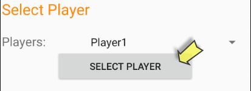

### 3.4 Cryptogram Home Screen
The "Home Screen" below will display all the cryptogram options that are allowed when a player is already registered and selected. From this screen you can do the following:
* Create a cryptogram
* Choose a cryptogram to solve
* List unsolved cryptograms
* List completed cryptograms
* Report cryptogram statistics
* Logout and return to select another player

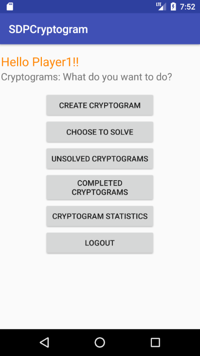

### 3.4.1 Create Cryptogram
To create a cryptogram click on the **[CREATE CRYPTOGRAM]** button from the main menu also referred to as "Home Screen" as shown above in 3.4.

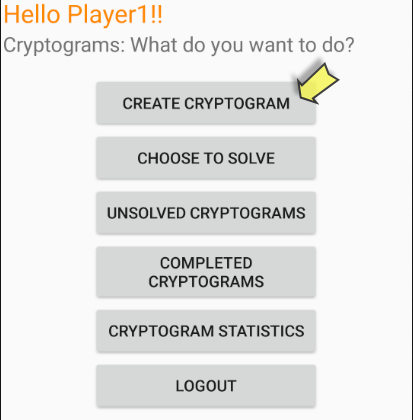

Once clicked you will see the New Cryptogram screen:
 
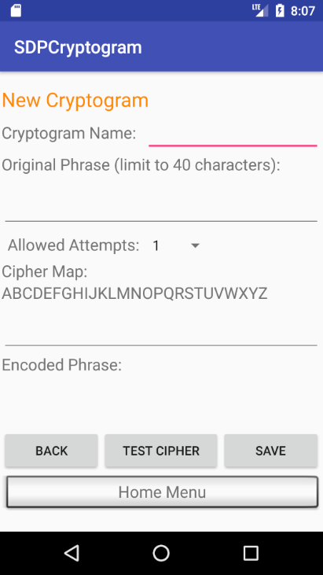 
 
You need to provide:
 1. Unique "Cryptogram Name"
 2. Original phrase up to 40 characters long
 3. Allowed attempts
 4. Cipher map
 
Remember, "allowed attempts" is the number of allowed failed submissions for a single player.  To enter the character map simply type the letter that should replace the letters in the sequenced alphabets. As you enter the characters the letter to be replaced will be colored in bright green. For example, below is a cipher map that shift the alphabets by on letter to the right:
 
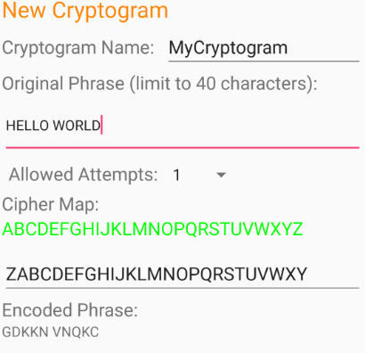 

Once all required information is entered, you can click on the
 * **[TEST CIPHER]** button to see the encoded phrase. Notice the encoded phrase **"GDKKN VNQKC"** for the example above. 
 * To save the cryptogram click the **[SAVE]** button. 
 * If you wish to cancel the cryptogram and return to main menu click on the **[BACK]** button or the **[HOME SCREEN]**.

When entering the cipher, make sure that you use the alphabet on once, and you use a unique cryptogram name.  When you click "SAVE" button, you will know whether you saved successfully or not and the error if any will be indicated.

### 3.4.2 Choose Cryptogram To solve
To choose a cryptogram to solve click on the **[CHOOSE TO SOLVE]** button from the main menu (Home Screen).
 
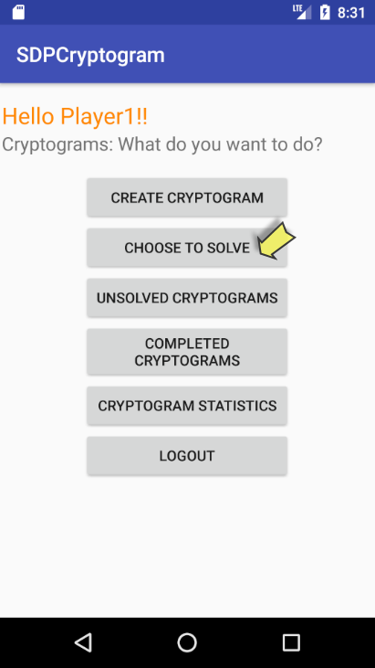

Once clicked you will see the Select Cryptogram to Solve screen. From this screen you select an unsolved cryptogram to solve using the drop down list of create a new cryptogram.
 
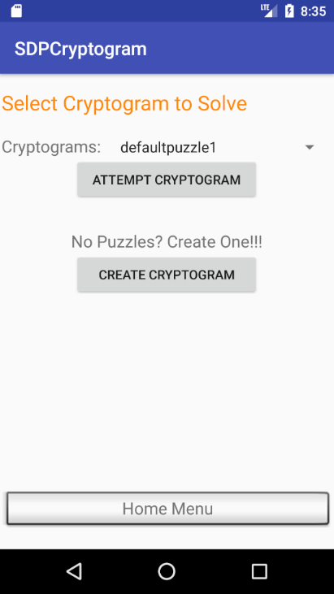

After you choose any of them, and click "ATTEMP", you can begin to solve the cryptogram.  See next section for help on how to solve the cryptogram.

## 3.4.2.1 Solve Cryptogram
At the "SOLVE cryptogram" screen, you will be provided the puzzle name, the encoded phrase and a cipher map entry to allow you to enter the characters to solve the cryptogram. 

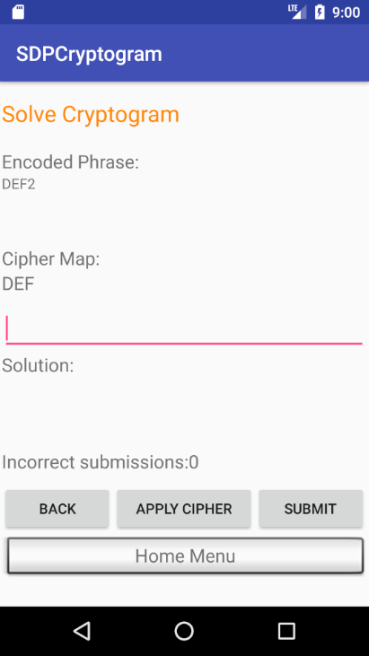

* Click **[APPLY CIPHER]** button to apply your cipher and view the solution prior to submitting.
* Click **[BACK]** button to go back and pick another cryptogram.
* Click **[HOME SCREEN]** button to go back to main menu or Home Screen. 
* Click **[Submit]** to check the result.

Remember, failed submission will increment the attempts number until the maximum allowed attempts are reached for the corresponding player account.  If unsolved within allowed attempts the cryptogram will no longer be available for the corresponding player. 

## 3.4.3 View Unsolved Cryptogram List
You can choose to view the unsolved cryptogram list from the main menu. This list will provide all the unsolved cryptogram with the name and the number of attempts along with number of remaining attempts.

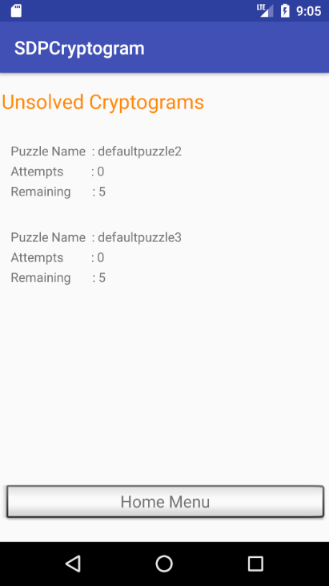

## 3.4.4 View Completed Cryptogram List
You can choose to view the completed cryptogram list from the main menu. This list will provide all the completed cryptogram with the name, whether solved or not, and the date when it is completed.

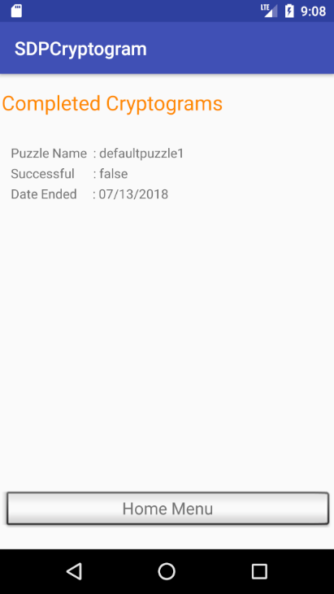

## 3.4.5 View Cryptogram Statistics
You can choose to view the cryptogram statistics from the main menu.  This list will provide the information for all the cryptogram in order of creation time. You can click each cryptogram to see the detailed information like creation date, number of players who have attempted to solve, and the username of the first three players to solve the cryptogram.

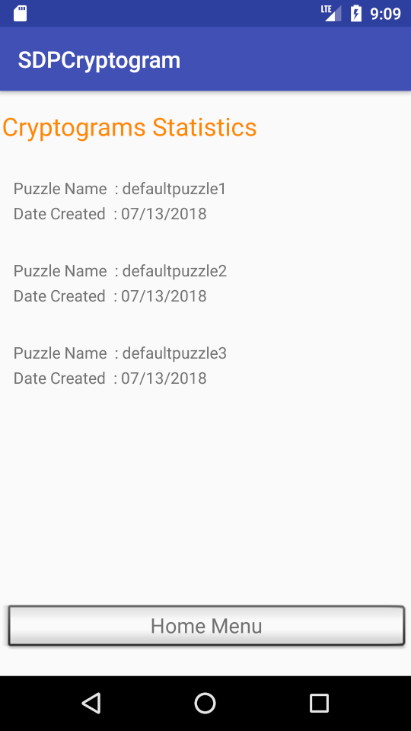

Here is an example of actual statistics for a particular cryptogram:

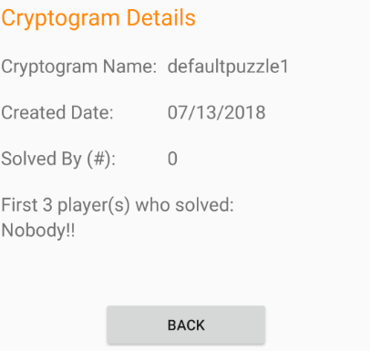

